## Mid-Term Project
## Project Scope
The goal is to predict arrival delays of commercial flights in US based on 2018-2019 data
## Project/Goals
In this project, our goal is to learn how to use some Machine learning tools to predict flight delays and cancellation.

## Process

### Data preparation:
### EDA and Data Insights:
#### The distribution of arrival delays:
We studied the distribution with two approaches:
- No distinction between delay<=0 and delay>0
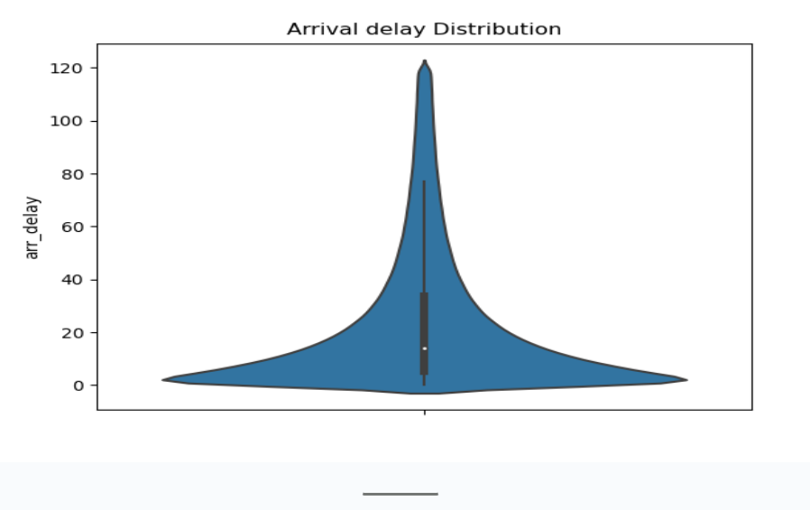
Using Shapiro test: the p-value=1, therefore the distribution is not normal. It has a mean of 5.47 min and a median of-6 min.
- Removing negative values and excluding delays more than 120 and using different significance values and Using Anderson Test
Arrivals delay
Statistic: 349090.452
15.000: 0.576, distribution is not normal at this significance level
10.000: 0.656, distribution is not normal at this significance level
5.000: 0.787, distribution is not normal at this significance level
2.500: 0.918, distribution is not normal at this significance level
1.000: 1.092, distribution is not normal at this significance level
### Average Delay per month of the year

The highest month for average delays matches the summer period and December January period which matches the general holiday period
## Weather impact
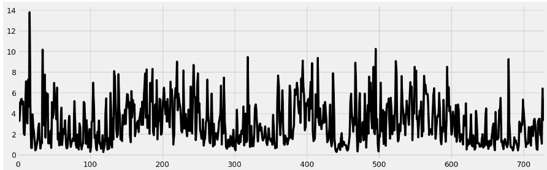# Weather impact
It seems that the variation of the percentage is the steady across the period studied.

### Taxi time: 
The correlation between Taxi time and volume of flight equal 11.96% for (alpha=0.5). Therefore, when the number of flight increases, the Taxi time increases as well.

### State with highest volume:
The analysis of the volume of traffic shows that 7 states cover 50% of the Overall Traffic.
in Order:
origin_state
CA    10.8440
TX    20.7198
FL    27.9676
IL    34.3042
GA    39.5752
NY    44.8218
NC    49.4206
CO    53.3148
PA    56.3188
DC    59.3036

### Comparison of flight speed using airtime for delayed at departure flight and not delayed
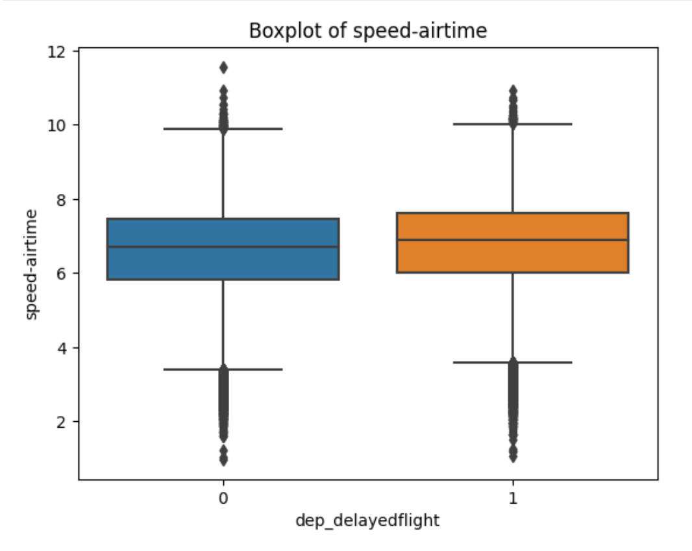

Statistically using the Levene test with an 0.05 significance delayed at departure flight and not delayed have same variance. The average speed for delayed at departure flight is higher than not delayed flights based on Ttest with 0.05 significance considering airtime/duration.

### Highest Hour of takeoff for long, short, medium:
Considering the usual business term for long, short (less than 600 miles), medium(between 600 and 1900 miles) and long (above 1900 miles) based on the distance. The mode for Takeoff hour is respectively 6, 7,11.

### The busiest Aiports:
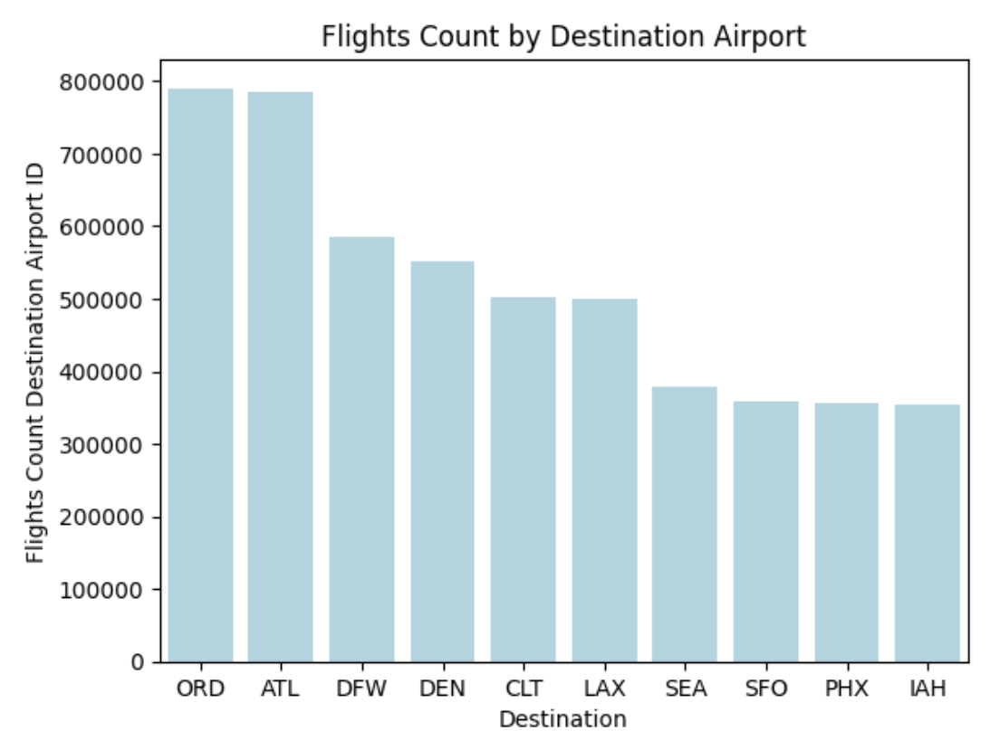
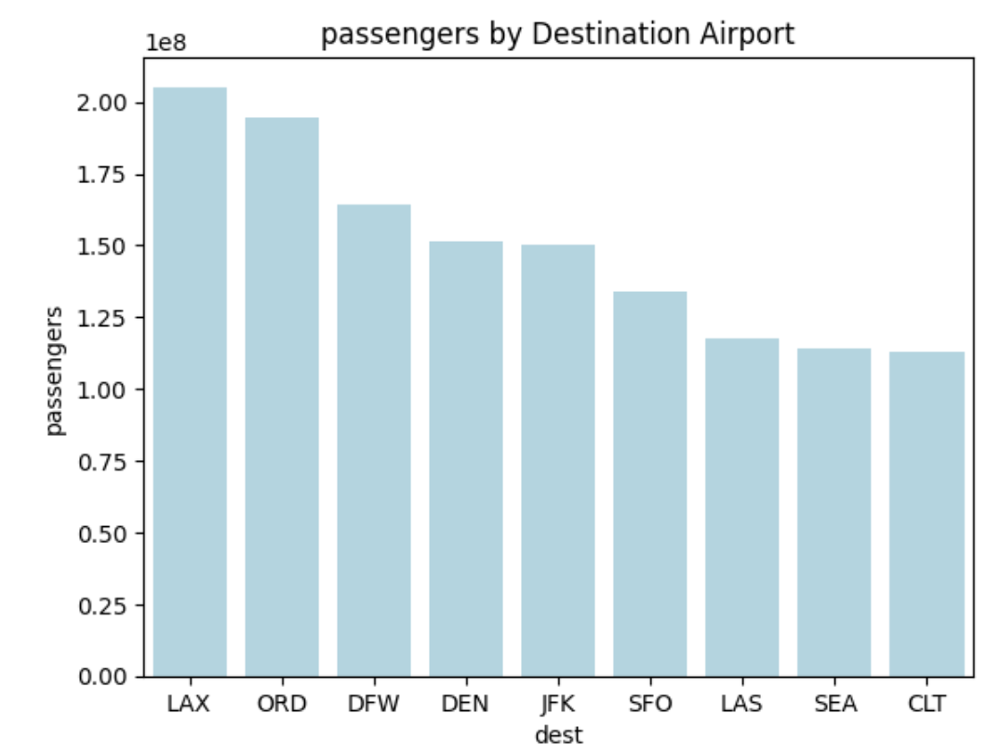

There is a difference between busiest airport based on the volume of flights and passengers. The pictures show the top 10 for each.

### Pair plot based on carrier monthly data:
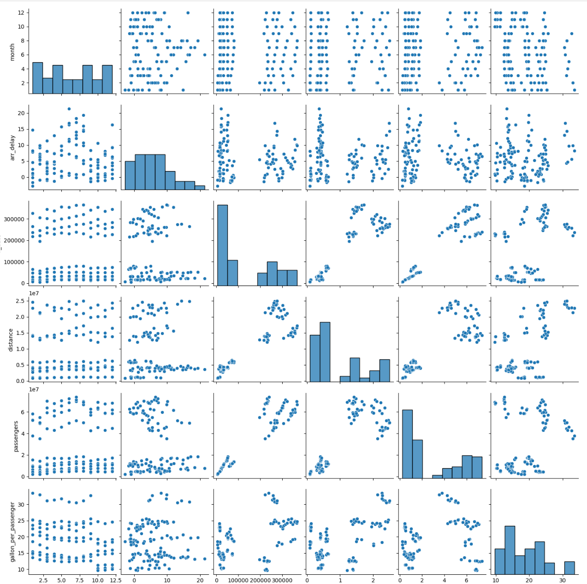

Based on the plot we can say that in general air_delay has no correlation with volume of flights or Passengers or fuel consumption by passenger or the distance related to a carrier.

### Other interesting points

Average arrival delay depends on day of the month, of the week and hour of arrival and departure.
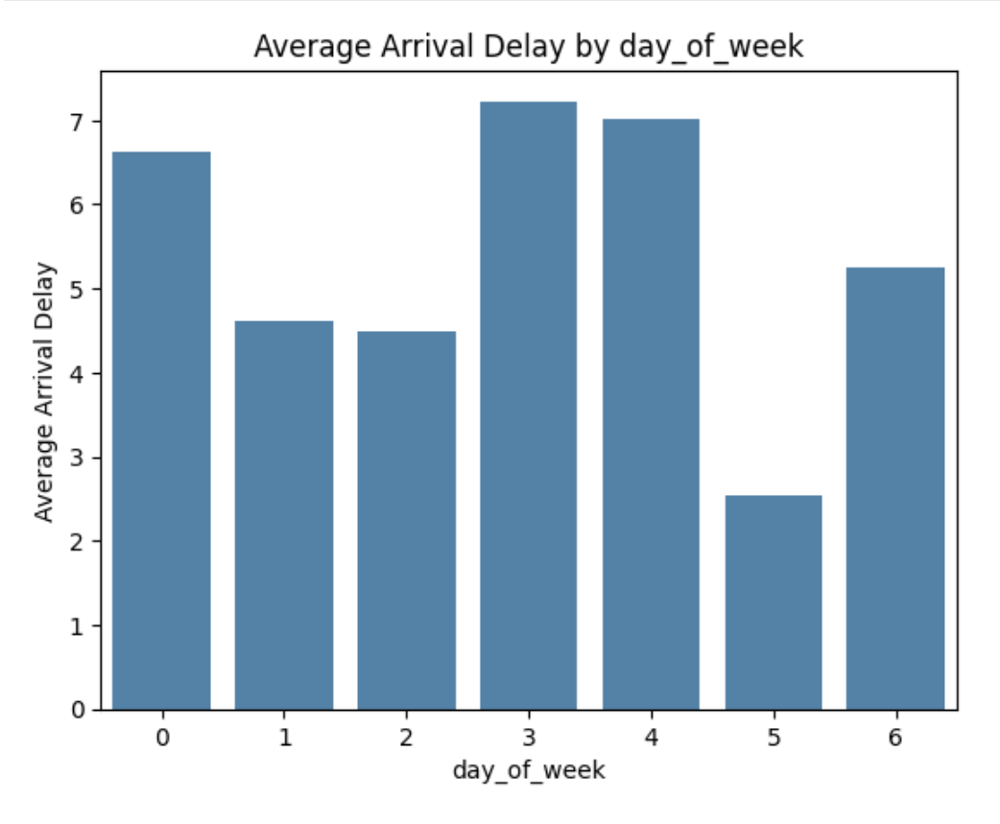
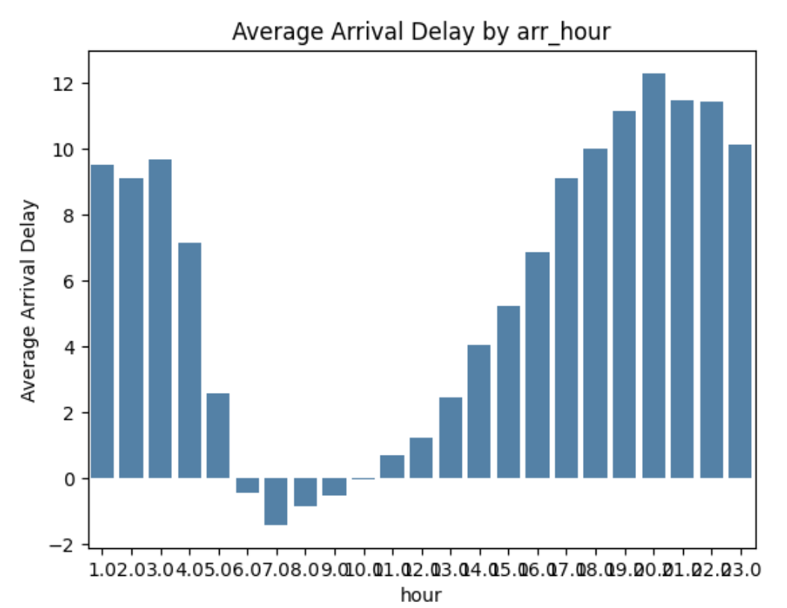
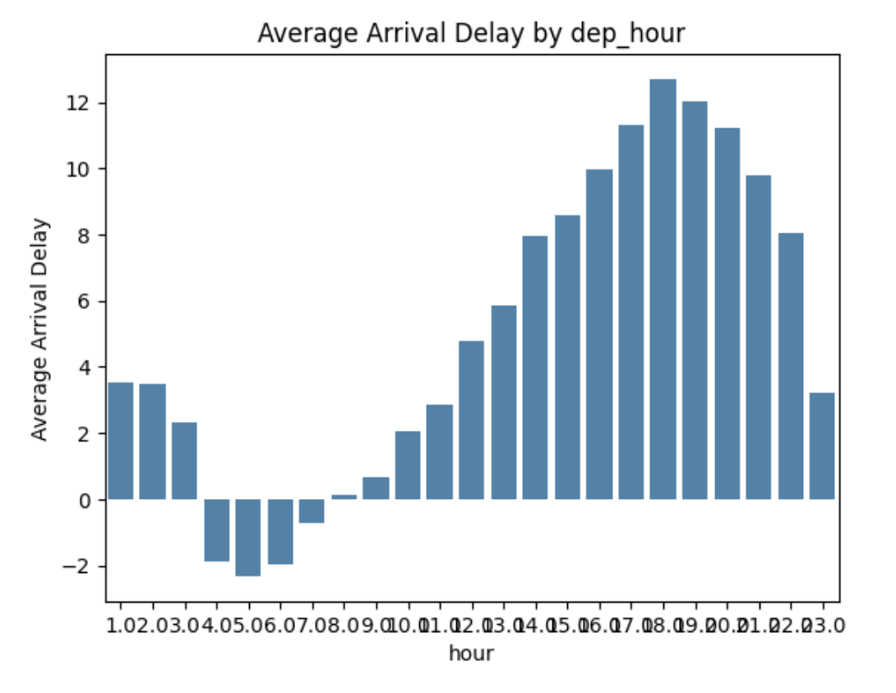
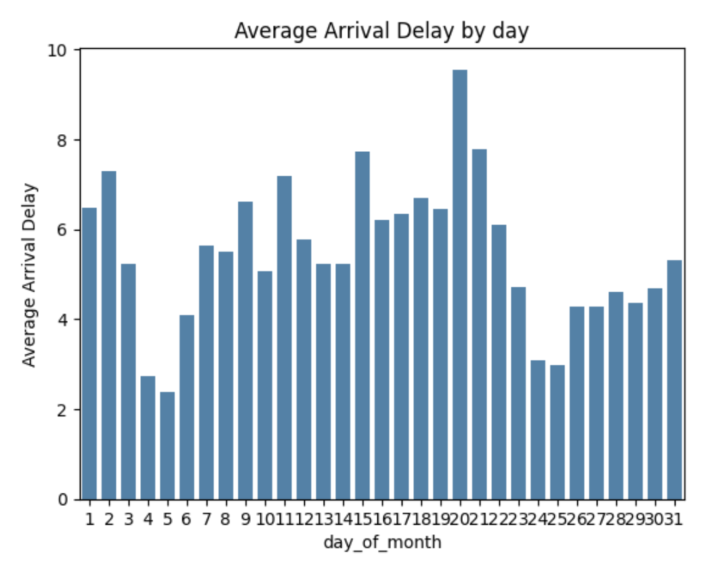

Carriers differe in the average delay
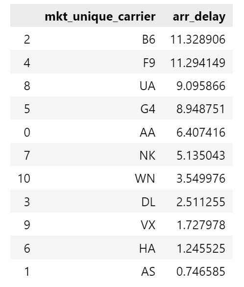

Airport differ in the average delay:

Top 10
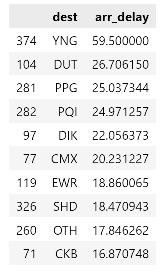

All
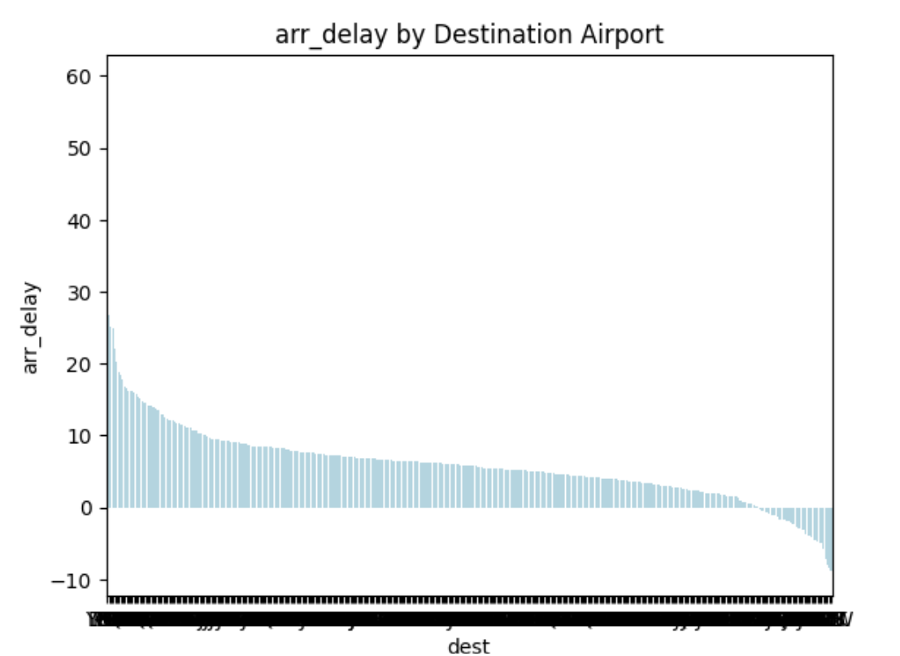

### cancellation comparison between carrier
There are only 11 carriers who have cancellation and the same carriers have an average delay related to the weather.
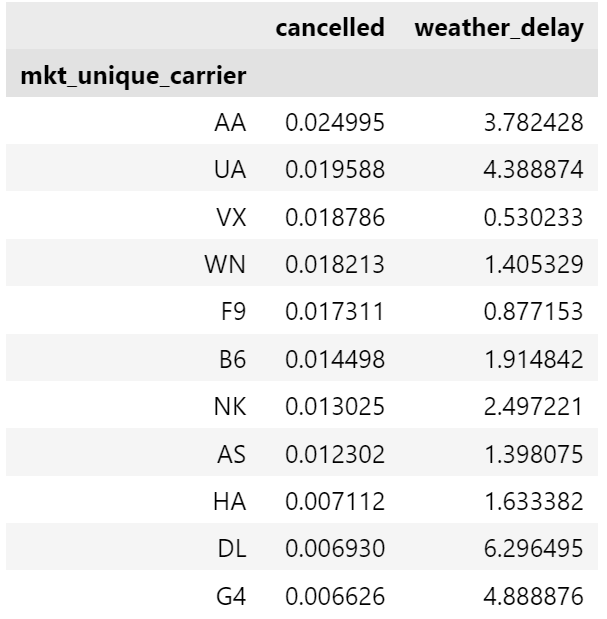

### Features selection and Model
We tried many models and Features selection. In this Section, I will list only the ones retained for the best performing models.

#### Arrival Delay prediction:

#### Features:

For this one, we selected the following features:
Month_day: day of the month
Week_day: day of the week
dep_hour: departure hour
arr_hour: arrival hour
Origin_dest_mean : Origin destination historical average arrival delay
month_carrier_mean: Carrier Monthly historical average arrival delay

### Models used
- Lineaire regression see below
- ElasticNet regression
R^2 of: 0.031512609451930705
- Radom Forest Regression
Negatif score
- XGBoost Regressor
0.08507206011548818
0.04028756208307038

The best Performing Model was a linear regression with:
Train R^2:    0.040355745822241995
Test R^2:    0.039288631080021674

#### Predictions
No sample of predictions since R^2 is low.

#### Cancellation prediction

#### Features:

For this one, we selected the following features:
Month_day: day of the month
Week_day: day of the week
dep_hour: departure hour
Origin_dest_mean : Origin destination historical average cancellation
month_carrier_mean: Carrier Monthly historical average cancellation
weather_delay_carrier_mean: Weather_delay historical average by carrier

### Models used
- Logistic regression
- Random forest classifier

#### Balancing the model
Two approaches were considered : the threshold and sampling equal data for the two classes

#### Selected Model Random Forest Classifier

To select the number of trees for the model, we run the model with different values. Based on the below picture and elbow method, n=5 or n=12 is the selected number.
We considered n=5.
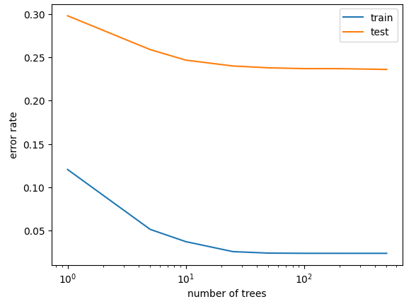

#### Score Results:
Below are the results:

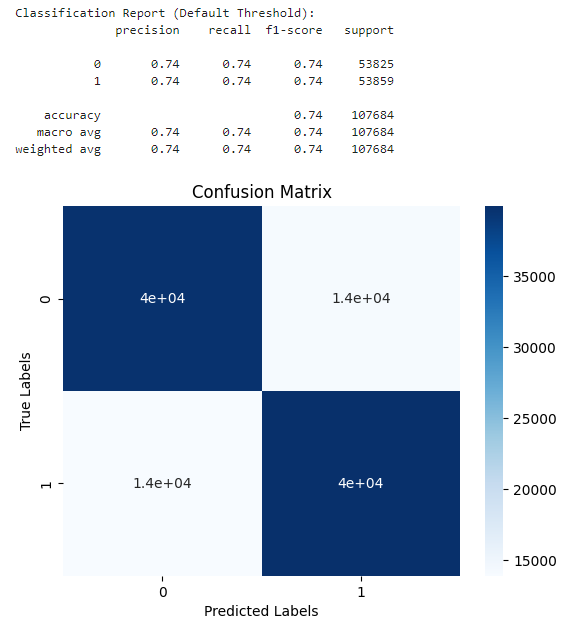

74% is across all scores.

#### Features importance

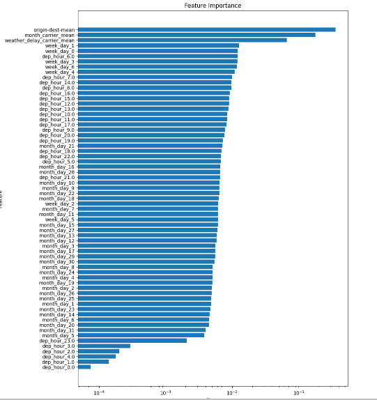

The features with the highest score are the ones related to historical data.

#### Predictions results
Refer to Sample_submission_cancellation.csv

predicted_cancellation
0    659380
1      1176

# Challenges:
The main challenges encountered:
- Size of data required with a computer with a RAM more Than 8GB
- Time limitation

# Future Steps to consider
- learn how to work with google collab
- More Features engineering
- Data on Administrative constraints by airports
- Data on Carrier limitations (Aircraft, Staff..)
- Try Ensemble models
- Try predicting delays at airport level

